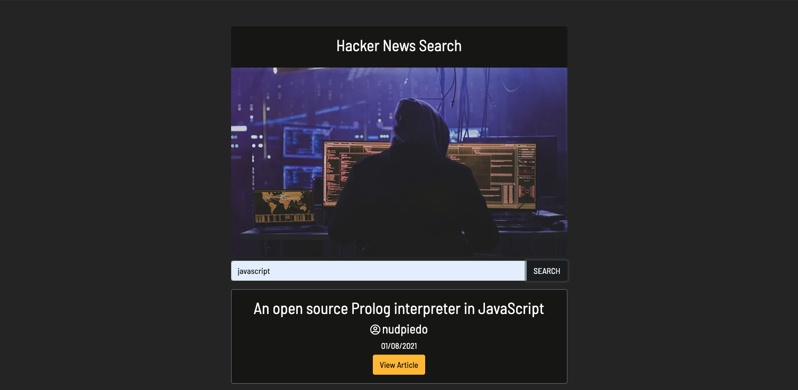

# Hacker News Algolia API

   

A React application that allows the user to search the Hacker News Algolia API. The search returns stories sorted by date that match the user's search term. The user is able to view the Title, Date and Author of the post and are provided a link to view it.

View the deployed application <a href = "https://gentle-cliffs-39257.herokuapp.com/">here</a>

## Table of Contents

- [Installation](#installation)
- [Resources](#resources)
- [Contributions](#contributions)
- [Testing](#testing)
- [Questions](#questions)
- [License](#license)

## Installation

If you would like to use the application in your local environment:

1. Clone the repo
2. Install required dependencies by running command `npm i`
3. Run command `npm start` to get started

Otherwise, visit the deployed application <a href = "https://gentle-cliffs-39257.herokuapp.com/">here</a>

## Resources

**React**  
**Bootstrap**  
**Redux**  
**Font Awesome**  
**Google Fonts**

## Contributions

All contributions to this project are welcome! Clone down the repo to your local machine, commit changes, push to GitHub, and open a pull request!

## Testing

No tests are set up for Hacker News Algolia API at this time. Feel free to write tests or search the application for bugs.

## Questions

If you have any further questions, feel free to reach out to me!  
<a href='https://www.github.com/twkirkpatrick'>Github</a>  
<a href='mailto:twk4491@gmail.com'>twk4491@gmail.com</a>

## License

Usage is provided under the MIT license.
